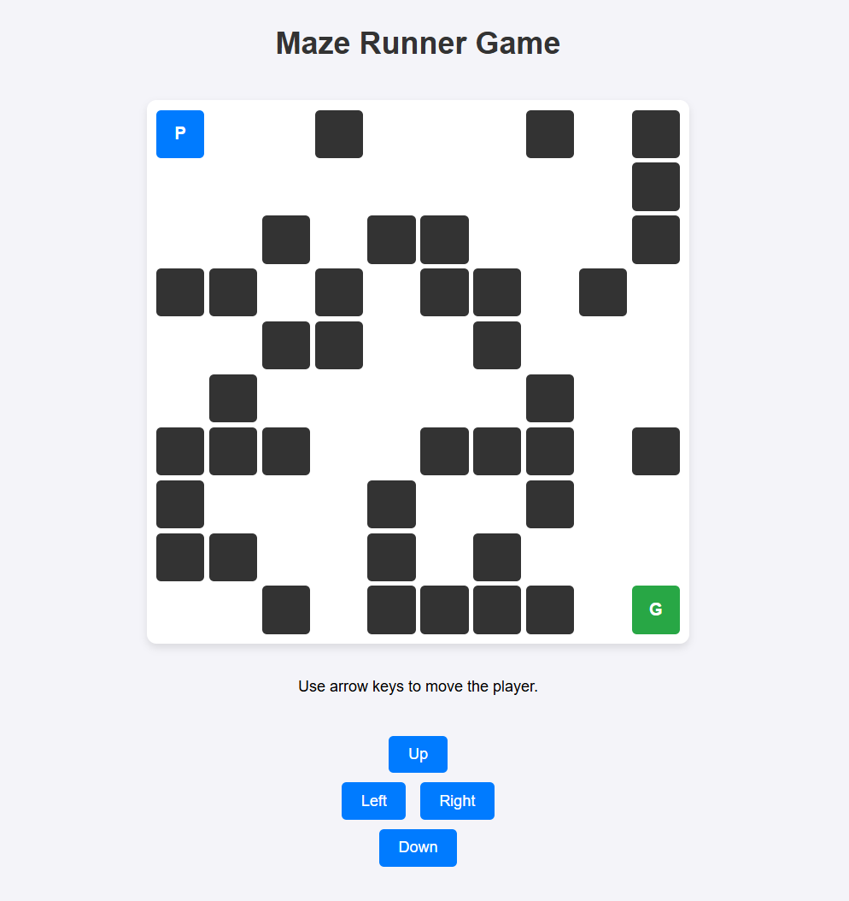

# Maze Runner Game



A fun and interactive maze game built with Python, Flask, and Docker. Navigate the player (P) through the maze to reach the goal (G) while avoiding obstacles!

## Features
- Interactive web-based maze game
- Real-time updates and smooth controls
- Modular architecture with Docker Compose
- Clean and modern UI

## Project Structure
- `game_logic.py`: Handles the maze generation and game logic
- `user_interaction.py`: Manages the web interface and user input
- `real_time_updates.py`: Handles real-time updates (e.g., using websockets)
- `templates/`: Contains the HTML, CSS, and JS for the frontend
- `docker-compose.yml`: Orchestrates the multi-container setup

## Getting Started

### Prerequisites
- [Docker](https://www.docker.com/get-started) installed on your system

### Running the Game
1. Clone this repository:
   ```sh
   git clone <repo-url>
   cd Maze_Runner_Game_Python-3
   ```
2. Build and start the services:
   ```sh
   docker-compose up --build
   ```
3. Open your browser and go to [http://localhost:5101](http://localhost:5101) to play the game!

## Controls
- Use the arrow keys or the on-screen buttons to move the player.

## Services
- **Game Logic**: http://localhost:5100
- **User Interaction (Web UI)**: http://localhost:5101
- **Real-Time Updates**: http://localhost:5102

## Screenshot


